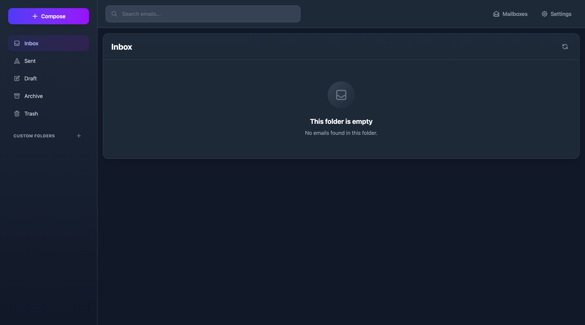
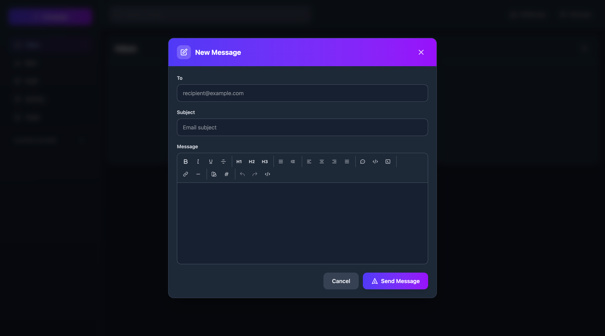

<div align="center">
  <a href="#">
    <h1 style="font-size: 4rem;">📧</h1>
    <h1>Email Explorer</h1>
  </a>
</div>

<p align="center">
    <em>A modern, full-stack email client running entirely on Cloudflare Workers</em>
</p>

<p align="center">
    <a href="https://github.com/G4brym/email-explorer/commits/main" target="_blank">
      
    </a>
    <a href="https://github.com/G4brym/email-explorer/issues" target="_blank">
      
    </a>
    <a href="https://github.com/G4brym/email-explorer/blob/main/LICENSE" target="_blank">
      
    </a>
</p>

# Email Explorer

Email Explorer is a full-stack, serverless email client that runs entirely on your own Cloudflare account. It provides a modern, fast, and secure way to manage your emails using Cloudflare's powerful infrastructure, including Workers, R2, Durable Objects, Email Routing, and Email Sending.

[](https://deploy.workers.cloudflare.com/?url=https://github.com/G4brym/email-explorer/tree/main/template)

## Table of Contents

- [Email Explorer](#email-explorer)
  - [Table of Contents](#table-of-contents)
  - [Quick Links](#quick-links)
  - [Overview](#overview)
    - [Screenshots](#screenshots)
  - [Why Email Explorer?](#why-email-explorer)
  - [Key Features](#key-features)
  - [Prerequisites](#prerequisites)
  - [Getting Started](#getting-started)
    - [Configuration](#configuration)
    - [First-Time Setup](#first-time-setup)
    - [Admin Operations](#admin-operations)
  - [Documentation](#documentation)
  - [Architecture](#architecture)
  - [Production Ready Features](#production-ready-features)
  - [Testing](#testing)
  - [Roadmap \& Future Enhancements](#roadmap--future-enhancements)
  - [Known Limitations](#known-limitations)
  - [Security](#security)
  - [Contributing](#contributing)
  - [Support](#support)
  - [License](#license)

## Quick Links

- 📖 **[User Guides](docs/features/index.md)** - Complete documentation for all features
- 🚀 **[Getting Started](#getting-started)** - Deploy in minutes
- 🔐 **[Authentication](docs/features/authentication.md)** - Setup your first account
- 🔑 **[Account Recovery](docs/features/account-recovery.md)** - Password reset via email
- 👥 **[Admin Panel](docs/features/admin-panel.md)** - Manage users and permissions
- ⚙️ **[Configuration](#configuration)** - Customize your deployment

## Overview

Email Explorer gives you a private, self-hosted email solution with a user-friendly web interface. By leveraging the Cloudflare ecosystem, it offers a cost-effective and scalable alternative to traditional email hosting. All your data is stored securely in your own R2 buckets and Durable Objects, giving you full control over your information.

### Screenshots

<div align="center">
  
  <p><em>Mailbox management and email list view</em></p>
</div>

<div align="center">
  
  <p><em>Rich text email composer with formatting options</em></p>
</div>

## Why Email Explorer?

**🔒 Privacy First**
- All data stays in YOUR Cloudflare account
- No third-party tracking or analytics
- You control your data completely

**💰 Cost-Effective**
- Runs on Cloudflare's generous free tier
- Pay only for what you use beyond free limits
- No monthly subscription fees

**⚡ Performance**
- Built on Cloudflare's global edge network
- Fast loading times worldwide
- Serverless architecture scales automatically

**🎨 Modern Experience**
- Clean, intuitive interface
- Rich text email composition
- Mobile-responsive design

**🛠️ Easy Setup**
- Deploy with one click
- Automatic mailbox creation
- Smart authentication setup

> **Note:** To send emails, you need to have [Cloudflare Email Sending](https://developers.cloudflare.com/email-routing/email-workers/send-email-workers/) enabled on your account. Receiving emails works through [Cloudflare Email Routing](https://developers.cloudflare.com/email-routing/).

> **Note:** When you first load your worker, there will be no mailboxes. They are automatically created when you start receiving emails.

## Key Features

- **🔒 Secure & Private**: Self-hosted on your Cloudflare account. No third-party tracking or data scanning.
- **🔐 Smart Authentication**: Automatic first-user admin setup with role-based access control and secure session management.
- **👥 Multi-User Support**: Admin panel for managing users and mailbox permissions with granular roles (Owner, Admin, Write, Read).
- **✍️ Rich Text Editor**: Full-featured WYSIWYG editor with formatting, colors, links, lists, and more - just like Gmail or Outlook.
- **↩️ Reply & Forward**: Reply to sender, reply all, or forward emails with automatic quoting and threading support.
- **✉️ Email Management**: Send, receive, and organize emails with a clean and intuitive interface.
- **📁 Folder Organization**: Create custom folders to organize your emails.
- **📎 Attachment Support**: View and download attachments directly in the browser.
- **🔍 Search**: Find emails quickly with full-text search across all your mailboxes.
- **📧 Contacts**: Manage your contacts with an integrated address book.
- **⚡ Serverless Architecture**: Each mailbox is its own Durable Object for optimal performance and isolation.
- **🗜️ Bulk Export**: Download single email or all emails in a folder as a ZIP archive for easy backup and transfer.

## Prerequisites

Before deploying Email Explorer, make sure you have:

- **Cloudflare Account** - [Sign up for free](https://dash.cloudflare.com/sign-up)
- **Domain Name** - Added to your Cloudflare account
- **Email Routing** - [Enable Email Routing](https://developers.cloudflare.com/email-routing/) for receiving emails
- **Email Sending** - [Enable Email Sending](https://developers.cloudflare.com/email-routing/email-workers/send-email-workers/) for sending emails (optional but recommended)
- **Node.js 18+** - For local development (not required for deployment)

**Cloudflare Services Used:**
- Workers (Compute)
- Durable Objects (State management)
- R2 (Object storage)
- D1 (SQL database via Durable Objects)
- Email Routing (Receive emails)
- Email Sending (Send emails)

Most of these services have generous free tiers that are sufficient for personal use.

## Getting Started

To deploy Email Explorer, you can use the "Deploy to Cloudflare" button above or run this command:

```bash
npm create cloudflare@latest -- --template=https://github.com/G4brym/email-explorer/tree/main/template
```

**Or deploy manually:**

```bash
# Clone the repository
git clone https://github.com/G4brym/email-explorer.git
cd email-explorer

# Install dependencies
pnpm install

# Deploy to Cloudflare
pnpm --filter email-explorer deploy
```

### Configuration

Email Explorer uses a factory function pattern for configuration. Edit `src/index.ts`:

```typescript
// Recommended: Smart Mode (Default)
export default EmailExplorer({
  auth: {
    enabled: true
    // registerEnabled not specified = smart mode
  },
  accountRecovery: {
    fromEmail: 'noreply@yourdomain.com'  // Optional: enable password reset via email
  }
})
```

**Smart Mode (Recommended):**
- First user to register automatically becomes admin
- Registration closes after first user
- Admins can create additional users via admin panel
- Perfect for production deployments

**Other Modes:**
```typescript
// Open Registration (Development/Testing)
export default EmailExplorer({
  auth: {
    enabled: true,
    registerEnabled: true  // Anyone can register
  }
})

// No Authentication (Single User)
export default EmailExplorer({
  auth: {
    enabled: false
  }
})

// With Account Recovery
export default EmailExplorer({
  auth: {
    enabled: true
  },
  accountRecovery: {
    fromEmail: 'noreply@yourdomain.com'  // Email address to send password reset links from
  }
})
```

**Configuration Options:**

| Option | Type | Default | Description |
|--------|------|---------|-------------|
| `auth.enabled` | boolean | `true` | Enable/disable authentication |
| `auth.registerEnabled` | boolean | `undefined` (smart mode) | Control user registration |
| `accountRecovery.fromEmail` | string | `undefined` (disabled) | Enable password recovery via email |

**Account Recovery:**
- When configured, users can reset forgotten passwords via email
- The `fromEmail` address must be a valid email on your Cloudflare account
- Requires [Cloudflare Email Sending](https://developers.cloudflare.com/email-routing/email-workers/send-email-workers/) to be enabled
- See [Account Recovery Guide](docs/features/account-recovery.md) for more details

### First-Time Setup

1. **Deploy your worker** with smart mode enabled (default)
2. **Visit your worker URL** in a browser
3. **Register the first user** - this becomes your admin account
4. **Log in** with your admin credentials
5. **Manage additional users** through the admin panel

### Admin Operations

As an admin, you can:
- Create new users
- Grant/revoke mailbox access
- Assign roles: `owner`, `admin`, `write`, or `read`
- Promote users to admin status

## Documentation

Comprehensive user guides are available for all features:

- **[Feature Documentation](docs/features/index.md)** - Complete user guides
  - [Authentication Guide](docs/features/authentication.md) - Account creation, login, and security
  - [Account Recovery Guide](docs/features/account-recovery.md) - Password reset via email
  - [Admin Panel Guide](docs/features/admin-panel.md) - User management and permissions
  - [Rich Text Editor Guide](docs/features/rich-text-editor.md) - Email formatting and composition
  - [Reply & Forward Guide](docs/features/reply-forward.md) - Email responses and threading

For developers:
- **[ROADMAP.md](ROADMAP.md)** - Project roadmap and planned features
- **[AGENTS.md](AGENTS.md)** - Technical architecture and development guide

## Architecture

Email Explorer is built with modern web technologies:

**Backend (Worker):**
- **Hono** - Fast, lightweight web framework
- **Cloudflare Durable Objects** - Distributed state management
- **Cloudflare R2** - Object storage for attachments
- **Cloudflare D1** - SQL database (via Durable Objects)
- **Cloudflare Email Routing** - Email sending and receiving

**Frontend (Dashboard):**
- **Vue.js 3** - Progressive JavaScript framework
- **TypeScript** - Type-safe development
- **Tailwind CSS** - Utility-first styling
- **TipTap** - Rich text editor
- **Pinia** - State management
- **Vite** - Fast build tooling

## Production Ready Features

✅ **Authentication & Security**
- Smart mode with automatic admin setup
- Session-based authentication (30-day expiry)
- Password hashing with Web Crypto API
- HttpOnly, Secure, SameSite cookies
- Role-based access control (RBAC)

✅ **Email Capabilities**
- Send and receive emails
- Reply and reply-all functionality
- Forward emails to others
- Rich text HTML composition
- Email threading and conversation tracking
- Attachment handling

✅ **User Management**
- Admin panel for user creation
- Granular mailbox permissions (Owner, Admin, Write, Read)
- Multi-user support with isolation
- Access grant and revoke capabilities

✅ **Organization**
- Custom folder creation
- Contact management
- Full-text email search
- Email filtering and organization

## Testing

Email Explorer includes comprehensive integration tests:

```bash
# Run all tests
pnpm --filter email-explorer test

# Run specific test suite
pnpm --filter email-explorer test auth
pnpm --filter email-explorer test endpoints

# Watch mode for development
pnpm --filter email-explorer test --watch
```

**Test Coverage:**
- ✅ Authentication flows (registration, login, sessions)
- ✅ Admin operations (user management, access control)
- ✅ Email operations (send, receive, folders)
- ✅ Search and filtering
- ✅ Contacts and attachments
- ✅ Security validations

## Roadmap & Future Enhancements

Planned features for future releases:

- [ ] Email templates for quick responses
- [ ] Two-factor authentication (2FA)
- [ ] Email drafts auto-save
- [ ] Conversation threading view
- [ ] Emoji picker in composer
- [ ] Table support in rich text editor
- [ ] Image uploads and inline images
- [ ] Email signatures
- [ ] Keyboard shortcuts
- [ ] Mobile app (React Native)

See [ROADMAP.md](ROADMAP.md) for detailed planning and progress.

## Known Limitations

**Current Limitations:**
- No email draft auto-save (manual save only)
- Image uploads not yet supported (URLs work)
- Single mailbox per user account (multiple access supported)

**Optional Features:**
- Password reset via email requires `accountRecovery.fromEmail` configuration

**Browser Compatibility:**
- Modern browsers required (Chrome 90+, Firefox 88+, Safari 14+)
- JavaScript must be enabled
- Cookies must be enabled for authentication

Please report any issues on our [GitHub Issues](https://github.com/G4brym/email-explorer/issues) page.

## Security

Email Explorer takes security seriously:

**🔐 Authentication Security**
- Passwords hashed with Web Crypto API (SHA-256)
- HttpOnly, Secure, SameSite cookies prevent XSS/CSRF
- 30-day session expiry for automatic logout
- Session tokens use cryptographic randomness

**🛡️ Data Protection**
- All data stored in YOUR Cloudflare account
- Email content rendered in sandboxed iframes
- No third-party data sharing
- Role-based access control (RBAC)

**🔒 Best Practices**
- Always use HTTPS (automatic with Cloudflare)
- Keep dependencies updated
- Regular security audits via GitHub Dependabot
- Comprehensive test coverage

**⚠️ Security Recommendations**
- Use strong, unique passwords (8+ characters)
- Enable Cloudflare's security features
- Regularly review user access permissions
- Log out from shared devices

**Report Security Issues:**
For security vulnerabilities, please email security issues privately rather than opening public issues.

## Contributing

We welcome contributions from the community! Here's how you can help:

**🐛 Bug Reports**
- Use the [GitHub Issues](https://github.com/G4brym/email-explorer/issues) page
- Include reproduction steps
- Specify your environment (browser, Cloudflare setup)

**✨ Feature Requests**
- Check existing issues first
- Explain the use case and benefit
- Consider submitting a PR if you can implement it

**💻 Code Contributions**
1. Fork the repository
2. Create a feature branch (`git checkout -b feature/amazing-feature`)
3. Make your changes with tests
4. Commit your changes (`git commit -m 'Add amazing feature'`)
5. Push to the branch (`git push origin feature/amazing-feature`)
6. Open a Pull Request

**📖 Documentation**
- Help improve user guides
- Fix typos or clarify instructions
- Add examples and use cases

**Development Setup:**
```bash
# Clone the repository
git clone https://github.com/G4brym/email-explorer.git
cd email-explorer

# Install dependencies
pnpm install

# Run tests
pnpm --filter email-explorer test

# Start development
pnpm --filter email-explorer dev
pnpm --filter dashboard dev
```

## Support

- **📖 Documentation**: Check [docs/features/](docs/features/) for user guides
- **💬 Discussions**: Use GitHub Discussions for questions
- **🐛 Issues**: Report bugs via GitHub Issues
- **📧 Email**: For security issues only

## License

This project is licensed under the MIT License - see the [LICENSE](LICENSE) file for details.

---

**Made with ❤️ for the self-hosted community**

If you find Email Explorer useful, please consider giving it a ⭐ on GitHub!
